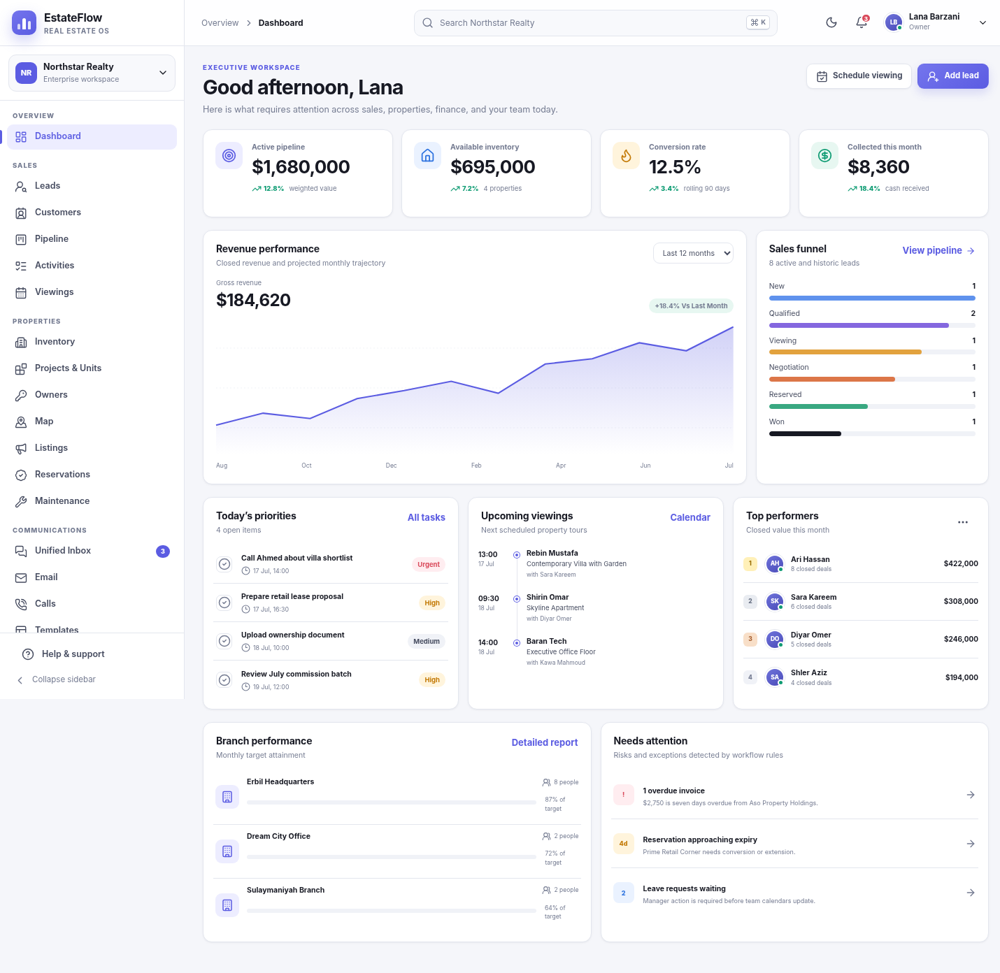
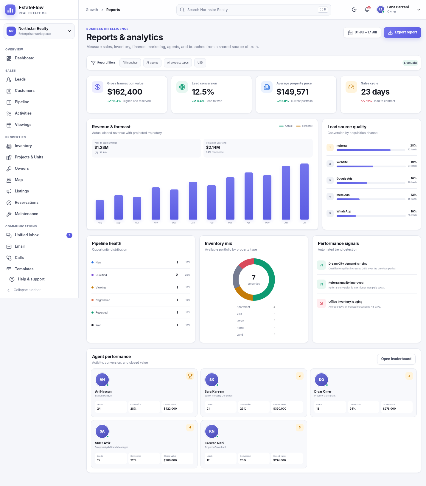
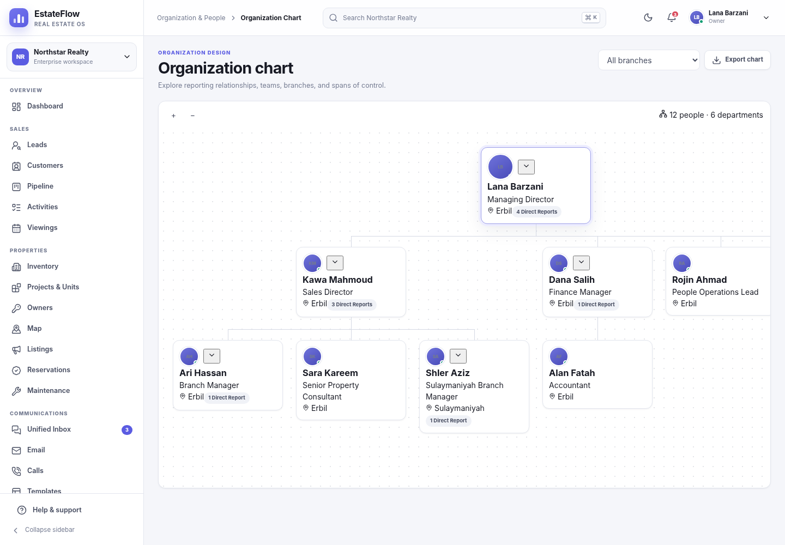

# EstateFlow Pro

A deployable, full-workspace real estate SaaS experience built with Next.js 16, React 19, TypeScript, and a modular multi-tenant domain model.

The repository opens directly as a polished working product demo. It includes seeded agency data, interactive workflows, role previews, package entitlements, tenant switching, dark mode, local persistence, imports/exports, and 48 routed workspace screens plus a dedicated sign-in experience.

## Product preview



<table>
  <tr>
    <td width="50%"></td>
    <td width="50%"></td>
  </tr>
  <tr>
    <td align="center"><strong>Reports & analytics</strong></td>
    <td align="center"><strong>Organization chart</strong></td>
  </tr>
</table>

## Deploy to Vercel

1. Extract the ZIP.
2. Create an empty GitHub repository.
3. Upload **all files and folders from this project root**. Do not upload the outer extracted folder as a nested directory.
4. In Vercel, choose **Add New → Project** and import the repository.
5. Keep the detected framework as **Next.js**.
6. Do not add a custom root directory.
7. Deploy.

Vercel uses the committed `pnpm-lock.yaml` and the explicit `pnpm` install/build commands in `vercel.json`. No environment variables are required for demo mode.

## Demo access

Open `/sign-in` or go directly to `/dashboard`.

Prefilled demo credentials:

- Email: `lana@northstar.demo`
- Password: `EstateFlow2026!`

The password is never transmitted. Authentication is simulated in demo mode so the repository can be reviewed immediately after deployment.

## Product areas

### Sales and CRM

- Executive dashboard
- Leads list and drag-and-drop pipeline
- Customer directory and profiles
- Activities, follow-ups, and viewing calendar
- Lead scoring, source attribution, assignment, and conversion reporting

### Property operations

- Inventory cards and tables
- Property details and status management
- Projects, developments, and units
- Owners
- Interactive visual property map
- Listing publishing status
- Reservations and expiry risks
- Maintenance requests

### Communications

- Unified WhatsApp/email/SMS-style inbox
- Conversation assignment and customer context
- Email workspace
- Call register
- Reusable message templates

### Contracts and operations

- Contract register
- Document vault
- Inspections
- Handover workflows

### Finance

- Finance overview
- Invoices and payment actions
- Payments and installments
- Expenses
- Agent commissions

### Organization & People

- People dashboard
- Employee directory and employment details
- Interactive organization chart
- Branches, cities, departments, and reporting lines
- Leave balances, requests, and approvals
- Attendance
- Onboarding
- Company assets

### Growth and intelligence

- Campaigns
- Property portals
- Social publishing
- Marketing automation
- Executive reports
- Permission-aware AI Copilot demo

### Administration

- Users
- Roles and permissions
- Plans, package entitlements, and upgrade previews
- Integrations
- Workflow automation
- Audit log
- Company settings

## Important demo behavior

The deployed product is fully usable as an interactive front-end SaaS demonstration. Demo data is persisted in browser `localStorage`, so actions survive refreshes on the same browser. The profile menu can export, import, or reset the workspace.

This repository deliberately separates the reviewable product experience from live customer infrastructure. Before storing real customer or employee information, connect the included domain model to production identity, database, storage, queue, and observability services. See:

- [`docs/ARCHITECTURE.md`](docs/ARCHITECTURE.md)
- [`docs/DEPLOYMENT.md`](docs/DEPLOYMENT.md)
- [`docs/PRODUCTION-READINESS.md`](docs/PRODUCTION-READINESS.md)
- [`docs/VALIDATION_REPORT.md`](docs/VALIDATION_REPORT.md)
- [`docs/RELEASE_NOTES.md`](docs/RELEASE_NOTES.md)
- [`supabase/migrations/0001_core.sql`](supabase/migrations/0001_core.sql)

## Local commands

```bash
corepack enable
pnpm install --frozen-lockfile
pnpm dev
```

Validation:

```bash
pnpm validate
```

Individual checks:

```bash
pnpm lint
pnpm typecheck
pnpm check:styles
pnpm test
pnpm build
pnpm test:smoke  # run after a production build
```

## Docker

```bash
docker compose up --build
```

The Docker image runs the verified Next.js production server.

## Project structure

```text
app/                     Next.js App Router and health endpoint
src/components/          Shared shell and UI primitives
src/features/            Product-area screens and interactions
src/lib/                 Analytics, permissions, plans, tenancy, validation
src/store/               Typed workspace state and demo persistence
src/types/               Domain model
tests/                   Automated domain/security/navigation tests
supabase/migrations/      Optional PostgreSQL/Supabase production foundation
docs/                    Architecture, deployment, and hardening guidance
.github/workflows/        Continuous integration
```

## Technology baseline

- Next.js 16 App Router
- React 19
- TypeScript strict mode
- pnpm lockfile
- Responsive CSS design system
- Lucide icon system
- Vitest
- ESLint with Next.js Core Web Vitals rules
- GitHub Actions
- Vercel and Docker deployment support

## License

`UNLICENSED` / proprietary by default. Replace the package license and add your commercial terms before public distribution.
